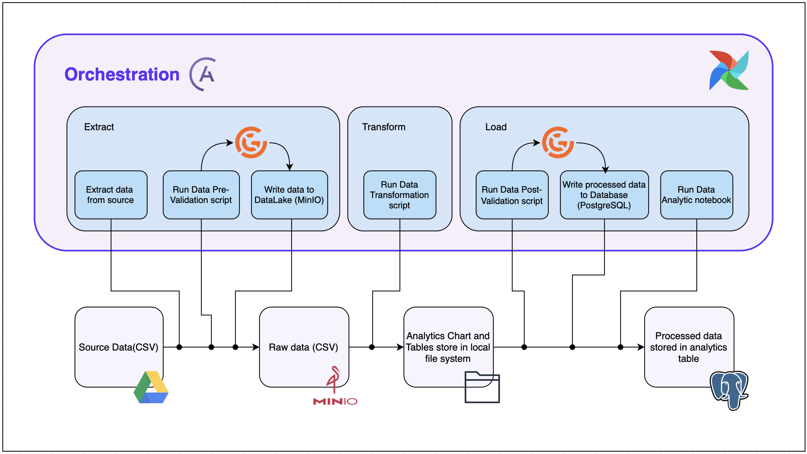

Cần 4 servers/vms với cấu hình như sau:

- sever 1: airbyte (8Gb 2 core)
- server 2: database + airflow (12Gb 6 core 100GB storage)
- server 3: superset (8GB 2 core)
- server 4: server thao tác, dùng để thao tác với các dịch vụ

airbyte cần 8Gb và 2 core (1 máy)

superset cần tối thiểu 8GB và 2 core (1 máy)

database + airflow (1 máy 6 core 12GB 100GB)

- airflow cần 4GB và 2 core ()
- postgres + pgAdmin: 2 core 4GB 50GB storage HDD/SDD
- minio: 2 GB 2 core 50Gb storage HDD/

Giới thiệu về mục tiêu
Giới thiệu về quy trình
Giới thiệu về cài đặt

Trình bày kiến trúc tổng quát
sau đó trọng tâm vào DataOps, cho phần MLOps lại

Tài liệu cài airbyte(done)
Tài liệu cài airflow(cần chỉnh sửa)
Tài liệu cài superset()
Tài liệu cài database (90%, sửa lại ảnh là ok)
Tài liệu cài datalake (chưa có)

Tài liệu cài đặt mlflow
Tài liệu setup PySpark

# Data Analysis cùng với hạ tầng DataOps cho quản lý dữ liệu

# Giới thiệu chung

## 1. DataOps là gì?

DataOps (Data Operations) là một phương pháp tiếp cận để quản lý pipeline dữ liệu một cách tự động, linh hoạt và có thể mở rộng. Nó kết hợp các nguyên tắc từ DevOps, Agile và Lean Manufacturing để đảm bảo dữ liệu luôn sẵn sàng, chính xác và đáng tin cậy trong quá trình phân tích.

_Tài liệu tham khảo_

## 2. Vì sao cần DataOps cho phân tích dữ liệu?

Trong môi trường phân tích hiện đại, dữ liệu đến từ nhiều nguồn, thay đổi liên tục và yêu cầu xử lý nhanh. DataOps giúp:

- Tự động hóa quá trình thu thâp, xử lý và phân phối dữ liệu.

- Cải thiện chất lượng và tính minh bạch của dữ liệu.

- Đảm bảo pipeline dữ liệu đáng tin cậy và có thể kiểm thử.

- Rút ngắn thời gian từ dữ liệu thô đến thông tin ra quyết định.

_Tài liệu tham khảo_

## 3. Mục tiêu của demo

Tài liệu này hướng dẫn xây dựng một hệ thống DataOps hoàn chỉnh, phục vụ cho Business Intelligence và phân tích dữ liệu, với các mục tiêu:

- Triển khai pipeline dữ liệu từ Data Collection, Data Processing đến Visualization.

- Sử dụng các công cụ mã nguồn mở (open-source) phổ biến và dễ tiếp cận.

- Bổ sung thêm

## 4. Kiến trúc của demo



## 5. Hướng dẫn cài đặt

**Bước 1.** Clone repo về máy

Mở terminal và chạy lệnh dưới đây

```sh
git clone https://github.com/PhungQuan-business/DataOps-bootstrap.git
```

Chúng tôi khuyên bạn nên sử dụng Jupyter Notebook vì khả năng cài đặt tất cả các phụ thuộc khi chạy và thực thi các lệnh magic. Để biết hướng dẫn cài đặt, vui lòng tham khảo [Tài liệu cài đặt Jupyter](https://jupyter.org/install). Ngoài ra, tất cả các phụ thuộc của dự án đều được liệt kê trong `requirements.txt`; bạn có thể tạo môi trường ảo cho những phụ thuộc này thay vì sử dụng IPython.

**Bước 2** Đảm bảo rằng bạn đã cài đặt [Astro CLI](https://docs.astronomer.io/astro/cli/install-cli) và [Docker](https://www.docker.com/products/docker-desktop) đang chạy. (Bổ sung cách cài)

**Bước 3** Sao chép file `.env.example` vào file mới có tên `.env` và điền thông tin {bổ sung tên các loại thông tin cần define}

```sh
touch .env && cp .env.example .env
```

**Step 3.** Using IPython/Jupyter Notebook, simply run the `train.ipynb`. you can use to command to execute from terminal

```sh
jupyter nbconvert --execute train.ipynb
```

NOTE:

- Trước mắt đã có khung ổn
- Đã xong các phần giới thiệu
- Chưa có ảnh kiến trúc: Kiến trúc đã có khung, cần xác định cách làm trước khi hoàn thành nốt kiến trúc: Done
- Chưa cấu trúc thư mục xong (ưu tiên)
- Chưa giải thích các step để cài đặt

Welcome! This project is a simple but functional blueprint for a RAG + fine-tuning pipeline with [Apache Airflow](https://airflow.apache.org/). Fork this project to create your own content generation pipelines!

Tools used:

- [Apache Airflow](https://airflow.apache.org/) run with the [Astro CLI](https://docs.astronomer.io/astro/cli/install-cli) to create a local instance in Docker
- [OpenAI](https://platform.openai.com/overview)
- [Weaviate](https://weaviate.io/) - running as a local instance in Docker
- [Streamlit](https://streamlit.io/) - running as a local instance in Docker
- [LangChain](https://www.langchain.com/) for chunking
- [tiktoken](https://github.com/openai/tiktoken) for token counting
- [Matplotlib](https://matplotlib.org/) for plotting
